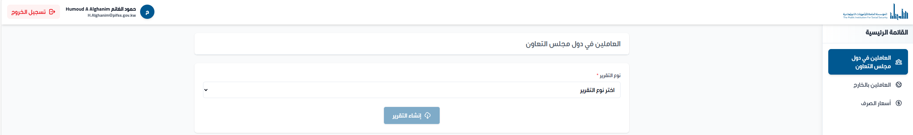

# PIFSS Angular Template

A modern, production-ready Angular 20 template specifically designed for the Public Institution for Social Security (PIFSS) Kuwait applications. This template provides a comprehensive foundation with pre-configured authentication, RTL support, and reusable components following PIFSS design standards.

## 🌟 Features

### Core Technologies

- **Angular 20** - Latest Angular framework with standalone components
- **Tailwind CSS v4** - Utility-first CSS framework with custom PIFSS theme
- **TypeScript 5.8** - Type-safe development
- **MSAL Authentication** - Azure AD/Entra ID integration for SSO
- **RxJS** - Reactive programming support

### Key Features

- ✅ **Arabic/RTL Support** - Full right-to-left layout support with custom Arabic fonts
- ✅ **MSAL Authentication** - Pre-configured Azure AD authentication with guards and interceptors
- ✅ **Reusable Components** - Production-ready UI components library
- ✅ **Advanced Table Component** - Feature-rich data table with pagination, sorting, and search
- ✅ **Form Validation** - Custom validators for Kuwait-specific data (Civil ID, etc.)
- ✅ **Error Handling** - Global error interceptor with Arabic messages
- ✅ **Loading States** - Automatic loading indicators for HTTP requests
- ✅ **Toast Notifications** - Clean toast notification system
- ✅ **File Download Service** - Utility for handling file downloads
- ✅ **Smart Caching System** - Automatic 30-second caching for GET requests
- ✅ **Responsive Design** - Mobile-first approach with Tailwind CSS
- ✅ **Azure DevOps Ready** - Pre-configured pipeline YAML

## 📁 Project Structure

```
src/
├── app/
│   ├── components/           # Reusable UI components
│   │   ├── button/           # Custom button with loading states
│   │   ├── card/             # Card container component
│   │   ├── date-picker/      # Date picker with validation
│   │   ├── forms/            # Form-related components
│   │   │   ├── form-field/   # Form field wrapper with labels
│   │   │   ├── form-input/   # Custom input component
│   │   │   └── form-select-group/ # Grouped select dropdown
│   │   ├── icons/            # PIFSS logo components
│   │   ├── navbar/           # Navigation bar with sidebar
│   │   ├── page-header/      # Page title header
│   │   ├── report-container/ # Report page wrapper
│   │   ├── table/            # Advanced data table component
│   │   └── toast/            # Toast notification component
│   │
│   ├── config/               # Configuration files
│   │   └── auth.config.ts    # MSAL authentication config
│   │
│   ├── interceptors/         # HTTP interceptors
│   │   ├── error.interceptor.ts    # Global error handling
│   │   └── loading.interceptor.ts  # Loading state management
│   │
│   ├── interfaces/           # TypeScript interfaces
│   │   ├── cache/            # Cache interfaces
│   │   ├── select/           # Select component interfaces
│   │   ├── table/            # Table component interfaces
│   │   └── toast/            # Toast notification interfaces
│   │
│   ├── resources/            # Static resources
│   │   └── endpoints.json    # API endpoint definitions
│   │
│   ├── services/             # Application services
│   │   ├── api-services/     # API communication services
│   │   │   └── base.service.ts
│   │   ├── app-services/     # Application-level services
│   │   │   ├── file-download.service.ts
│   │   │   ├── loading.service.ts
│   │   │   └── msal-auth.service.ts
│   │   └── component-services/
│   │       ├── table.service.ts    # Table state management
│   │       └── toast.service.ts    # Toast notification service
│   │
│   ├── utils/                # Utility functions
│   │   ├── CacheUtils.class.ts     # Cache management utilities
│   │   ├── DateUtils.class.ts      # Date manipulation utilities
│   │   ├── apiValidationError.ts   # API error parsing
│   │   └── validators.ts           # Custom form validators
│   │
│   ├── pages/                # Page components
│   │   ├── showcase/         # Component showcase page
│   │   └── employee-list/    # Table component example
│   │
│   ├── app.component.ts      # Root component
│   ├── app.config.ts         # App configuration
│   └── app.routes.ts         # Route definitions
│
├── assets/
│   └── fonts/                # Custom Arabic/English fonts
│       ├── Arabic/
│       └── English/
│
├── environment.ts            # Development environment
└── environment.prod.ts       # Production environment
```

## 🚀 Getting Started

### Prerequisites

- Node.js 22.x or higher
- npm or yarn package manager
- Angular CLI (`npm install -g @angular/cli@20`)

### Installation & Project Setup

1. **Clone the repository**

   ```bash
   git clone [repository-url]
   cd PIFSS-Template
   ```

2. **Rename the project from PIFSS-Template to your project name**

   Update the following files with your project name (replace `YOUR-PROJECT-NAME` with your actual project name):

   **a. package.json**

   ```json
   {
     "name": "your-project-name",  // Change from "pifss-template"
     ...
   }
   ```

   **b. angular.json**

   ```json
   {
     "projects": {
       "YOUR-PROJECT-NAME": {  // Change from "PIFSS-Template"
         ...
       }
     }
   }
   ```

   **c. package-lock.json**

   - Search and replace all occurrences of `"pifss-template"` with `"your-project-name"`
   - Search and replace all occurrences of `"PIFSS-Template"` with `"YOUR-PROJECT-NAME"`

   **d. src/index.html**

   ```html
   <title>YOUR-PROJECT-NAME</title>
   <!-- Change from "PIFSSTemplate" -->
   ```

   **e. azure-pipelines.yml**

   ```yaml
   # Update the SourceFolder path
   SourceFolder: "dist/YOUR-PROJECT-NAME/browser" # Change from "dist/YOUR-PROJECT-NAME/browser"

   # Update the base href
   customCommand: "run build -- --configuration=production --base-href /YOUR-APP-PATH/"
   ```

3. **Install dependencies**

   ```bash
   npm install
   ```

4. **Configure MSAL Authentication**

   Update `src/environment.ts` and `src/environment.prod.ts`:

   ```typescript
   msal: {
     entraId: {
       clientId: 'YOUR-CLIENT-ID',  // Get from infrastructure team
       apiScopes: ['api://YOUR-CLIENT-ID/User.Read']
     }
   }
   ```

5. **Update API Base URL**

   ```typescript
   baseurl: "https://your-api-endpoint.com";
   ```

6. **Run the development server**
   ```bash
   npm start
   ```
   Navigate to `http://localhost:4200`

## 🔧 Configuration

### MSAL/Azure AD Setup

1. Contact your infrastructure team (specifically Nidheesh Nattiala) to:

   - Get your application's Client ID
   - Set up the User.Read scope
   - Configure redirect URIs

2. Update the authentication configuration in `src/app/config/auth.config.ts`

3. The tenant ID is pre-configured for PIFSS: `31819927-6989-4bd0-b5e5-81740d4154c3`

### Adding New Routes

Update `src/app/app.routes.ts`:

```typescript
{
  path: 'your-route',
  title: 'عنوان الصفحة',
  canActivate: [MsalGuard], // Uncomment after MSAL setup
  loadComponent: () => import('./pages/your-component').then(m => m.YourComponent)
}
```

### Adding Navigation Links

Update the links array in `src/app/components/navbar/navbar.component.ts`:

```typescript
links = [
  {
    label: "اسم الصفحة",
    path: "/your-route",
    icon: "icon-name",
  },
];
```

Navbar Example:


## 💾 Caching System

The template includes an intelligent caching system that automatically caches GET requests for 30 seconds to improve performance and reduce server load.

### Features

- **Automatic Caching** - All GET requests are cached for 30 seconds by default
- **Smart Invalidation** - Cache automatically invalidates when data is modified (POST/PUT/DELETE)
- **Memory Management** - Automatic cleanup of expired cache entries
- **Development Tools** - Built-in debugging and cache statistics
- **Configurable** - Easy to enable/disable and adjust cache duration

### How It Works

The caching system is implemented in the `BaseService` class and uses RxJS observables with `shareReplay` to prevent duplicate requests:

```typescript
// All GET requests are automatically cached
this.baseService.get("/api/employees"); // First call - hits server
this.baseService.get("/api/employees"); // Within 30 seconds - returns cached data
```

### Cache Management

#### Manually Clear Cache

```typescript
// Clear all cache
this.baseService.clearCache();

// Clear cache for specific URL
this.baseService.clearCacheForUrl("/api/employees");

// Clear cache for resource type
this.baseService.invalidateCacheForResource("employees");
```

#### Disable Caching

You can temporarily disable caching for debugging:

```typescript
// Via localStorage (persistent)
localStorage.setItem("disableCache", "true");

// Via URL parameter (temporary)
//localhost:4200?noCache=true

// Get fresh data regardless of cache
http: this.baseService.getFresh("/api/employees");
```

#### Cache Statistics

Monitor cache performance in development:

```typescript
const stats = this.baseService.getCacheStats();
console.log(stats);
// Output: { size: 5, validCount: 3, expiredCount: 2, entries: [...] }
```

### Cache Configuration

The cache duration is set to 30 seconds by default. To modify:

```typescript
// In CacheUtils.class.ts
private static readonly CACHE_DURATION_MS = 30000; // 30 seconds
```

### Debugging

Enable verbose logging in development:

```typescript
// Enable cache logging
localStorage.setItem("verboseLogging", "true");
```

This will log cache events in the console:

- `[Cache Hit]` - Data served from cache
- `[Cache Miss]` - Data fetched from server
- `[Cache Store]` - Data stored in cache
- `[Cache Invalidate]` - Cache entry removed

### Best Practices

1. **Don't cache sensitive data** - User-specific or frequently changing data should use `getFresh()`
2. **Use appropriate cache duration** - 30 seconds works well for most cases
3. **Monitor cache size** - Use `getCacheStats()` in development to ensure cache doesn't grow too large
4. **Test with cache disabled** - Always test your application with `?noCache=true` to ensure it works without caching

### Example Usage

```typescript
export class EmployeeService extends BaseService {
  // Automatically cached for 30 seconds
  getEmployees() {
    return this.get<Employee[]>("/api/employees");
  }

  // Cache automatically invalidated after update
  updateEmployee(id: number, data: Employee) {
    return this.put(`/api/employees/${id}`, data);
  }

  // Force fresh data (no cache)
  getEmployeeFresh(id: number) {
    return this.getFresh<Employee>(`/api/employees/${id}`);
  }

  // Manual cache management
  refreshEmployeeData() {
    this.clearCacheForUrl("/api/employees");
    return this.getEmployees();
  }
}
```

## 📦 Available Components

### Toast Notifications

```typescript
// In your component
import { ToastService } from './services';

constructor(private toastService: ToastService) {}

// Show success toast
this.toastService.showSuccess('Operation completed successfully!');

// Show error toast
this.toastService.showError('An error occurred');

// Show with custom duration (in milliseconds)
this.toastService.showSuccess('Message', 5000);
```

### Button Component

```html
<app-button text="نص الزر" [loading]="isLoading" [disabled]="isDisabled" (btnClick)="handleClick()" [showIcon]="true" iconType="download"> </app-button>
```

### Form Components

```html
<app-form-field label="العنوان" [required]="true" [showError]="hasError" [errorMessage]="errorMsg">
  <app-form-input formControlName="fieldName" type="text" placeholder="نص توضيحي"> </app-form-input>
</app-form-field>
```

### Date Picker

```html
<app-date-picker formControlName="date" [maxDate]="maxDate" [minDate]="minDate"> </app-date-picker>
```

### Select with Groups

```html
<app-form-select-group formControlName="department" placeholder="اختر القسم" [groups]="departmentGroups" [showIndex]="true"> </app-form-select-group>
```

## 📊 Table Component

The template includes a powerful, reusable table component with built-in features for pagination, sorting, searching, and selection. Perfect for displaying tabular data with minimal setup.

### Table Features

- ✅ **Pagination** - Built-in pagination with customizable page sizes
- ✅ **Sorting** - Column-based sorting (ascending/descending)
- ✅ **Search** - Real-time search across all data fields with Arabic text normalization
- ✅ **Selection** - Row selection with checkbox support
- ✅ **Loading States** - Automatic loading overlay
- ✅ **Actions** - Customizable row actions with conditional rendering
- ✅ **Responsive** - Mobile-friendly with horizontal scrolling
- ✅ **Custom Templates** - Support for custom cell templates
- ✅ **Static & Dynamic Data** - Works with both API and static data

### Basic Table Usage

```typescript
import { TableComponent } from './components';
import { TableColumn } from './interfaces';

// Define your columns
columns: TableColumn[] = [
  {
    key: 'id',
    label: 'الرقم',
    sortable: true,
    width: '80px'
  },
  {
    key: 'name',
    label: 'الاسم',
    sortable: true
  },
  {
    key: 'salary',
    label: 'الراتب',
    sortable: true,
    type: 'currency',
    align: 'left'
  },
  {
    key: 'joinDate',
    label: 'تاريخ الالتحاق',
    sortable: true,
    type: 'date'
  },
  {
    key: 'isActive',
    label: 'الحالة',
    sortable: true,
    type: 'boolean'
  }
];
```

```html
<app-table [columns]="columns" [data]="tableData" [totalItems]="totalItems" [loading]="isLoading" [selectable]="true" [searchable]="true" (pageChange)="onPageChange($event)" (pageSizeChange)="onPageSizeChange($event)" (sortChange)="onSortChange($event)" (searchChange)="onSearchChange($event)" (selectionChange)="onSelectionChange($event)" (refresh)="onRefresh()" />
```

### Table Configuration

#### Column Configuration

```typescript
interface TableColumn {
  key: string; // Data property key
  label: string; // Column header label
  sortable?: boolean; // Enable sorting (default: false)
  width?: string; // Column width (e.g., '150px')
  align?: "left" | "center" | "right"; // Text alignment
  type?: "text" | "number" | "date" | "currency" | "boolean" | "custom";
  format?: (value: any) => string; // Custom formatter function
  customTemplate?: any; // Custom Angular template
}
```

#### Table Inputs

| Input             | Type            | Default                | Description                            |
| ----------------- | --------------- | ---------------------- | -------------------------------------- |
| `columns`         | `TableColumn[]` | Required               | Column definitions                     |
| `data`            | `any[]`         | Required               | Data to display                        |
| `totalItems`      | `number`        | 0                      | Total number of items (for pagination) |
| `loading`         | `boolean`       | false                  | Show loading overlay                   |
| `selectable`      | `boolean`       | false                  | Enable row selection                   |
| `searchable`      | `boolean`       | true                   | Show search box                        |
| `rowClickable`    | `boolean`       | false                  | Enable row click events                |
| `actions`         | `TableAction[]` | []                     | Row action buttons                     |
| `pageSizeOptions` | `number[]`      | [10, 25, 50, 100]      | Page size options                      |
| `initialPageSize` | `number`        | 10                     | Initial page size                      |
| `emptyMessage`    | `string`        | 'لا توجد بيانات للعرض' | Message when no data                   |

#### Table Outputs

| Output            | Type                                               | Description                       |
| ----------------- | -------------------------------------------------- | --------------------------------- |
| `pageChange`      | `number`                                           | Fired when page changes           |
| `pageSizeChange`  | `number`                                           | Fired when page size changes      |
| `sortChange`      | `{sortBy: string, sortDirection: 'asc' \| 'desc'}` | Fired on sort                     |
| `searchChange`    | `string`                                           | Fired on search (debounced 500ms) |
| `selectionChange` | `any[]`                                            | Fired when selection changes      |
| `rowClick`        | `any`                                              | Fired when row is clicked         |
| `refresh`         | `void`                                             | Fired when refresh button clicked |

### Advanced Table Features

#### Row Actions

Add custom actions for each row:

```typescript
actions: TableAction[] = [
  {
    label: 'عرض',
    icon: '<svg>...</svg>',  // Optional icon HTML
    handler: (row) => this.viewItem(row),
    class: 'text-blue-600 hover:text-blue-800'
  },
  {
    label: 'تعديل',
    handler: (row) => this.editItem(row),
    condition: (row) => row.isActive, // Show only for active items
    class: 'text-green-600 hover:text-green-800'
  },
  {
    label: 'حذف',
    handler: (row) => this.deleteItem(row),
    class: 'text-red-600 hover:text-red-800'
  }
];
```

#### Custom Cell Templates

Use custom templates for complex cell content:

```typescript
// In your component
@ViewChild('statusTemplate', { static: true }) statusTemplate!: TemplateRef<any>;

columns: TableColumn[] = [
  {
    key: 'status',
    label: 'الحالة',
    customTemplate: this.statusTemplate
  }
];
```

```html
<!-- Define the template -->
<ng-template #statusTemplate let-row let-value="value">
  <span class="badge" [class.badge-success]="value === 'active'"> {{ value }} </span>
</ng-template>
```

#### Custom Formatting

Format cell values with custom functions:

```typescript
columns: TableColumn[] = [
  {
    key: 'percentage',
    label: 'النسبة',
    type: 'number',
    format: (value) => `${(value * 100).toFixed(2)}%`
  },
  {
    key: 'status',
    label: 'الحالة',
    format: (value) => {
      const statusMap = {
        'pending': 'قيد الانتظار',
        'approved': 'موافق عليه',
        'rejected': 'مرفوض'
      };
      return statusMap[value] || value;
    }
  }
];
```

### Table Service

The template includes a `TableService` for managing table state with API integration:

#### With API Data

```typescript
import { TableService } from "./services";

export class EmployeeListComponent implements OnInit {
  tableState!: TableStateManager<Employee>;

  constructor(private tableService: TableService) {}

  ngOnInit() {
    // Create managed table state with automatic API calls
    this.tableState = this.tableService.createTableState<Employee>("/api/employees", {
      page: 1,
      pageSize: 10,
      sortBy: "name",
      sortDirection: "asc",
    });
  }

  // Event handlers
  onPageChange(page: number) {
    this.tableState.setPage(page);
  }

  onPageSizeChange(pageSize: number) {
    this.tableState.setPageSize(pageSize);
  }

  onSortChange(sort: { sortBy: string; sortDirection: "asc" | "desc" }) {
    this.tableState.setSort(sort.sortBy, sort.sortDirection);
  }

  onSearchChange(search: string) {
    this.tableState.setSearch(search);
  }

  onRefresh() {
    this.tableState.refresh();
  }
}
```

```html
<!-- Template with observables -->
<app-table [columns]="columns" [data]="(tableState.data$ | async) || []" [totalItems]="(tableState.totalItems$ | async) || 0" [loading]="(tableState.loading$ | async) || false" (pageChange)="onPageChange($event)" (pageSizeChange)="onPageSizeChange($event)" (sortChange)="onSortChange($event)" (searchChange)="onSearchChange($event)" (refresh)="onRefresh()" />
```

#### With Static Data

```typescript
// For development or static data
staticData = [
  { id: 1, name: 'أحمد محمد', salary: 2500 },
  { id: 2, name: 'فاطمة علي', salary: 3000 },
  // ... more data
];

ngOnInit() {
  // Create table state with static data
  this.tableState = this.tableService.createStaticTableState(
    this.staticData,
    {
      page: 1,
      pageSize: 10,
      sortBy: 'name',
      sortDirection: 'asc'
    }
  );
}
```

### Table State Manager Interface

```typescript
interface TableStateManager<T> {
  data$: Observable<T[]>; // Table data
  totalItems$: Observable<number>; // Total item count
  loading$: Observable<boolean>; // Loading state
  error$: Observable<string | null>; // Error messages
  currentState$: Observable<TableQueryParams>; // Current parameters

  setPage(page: number): void;
  setPageSize(pageSize: number): void;
  setSort(sortBy: string, direction: "asc" | "desc"): void;
  setSearch(search: string): void;
  setFilters(filters: Record<string, any>): void;
  refresh(): void;
  reset(): void;
}
```

### API Response Format

The table expects paginated API responses in this format:

```typescript
interface PaginatedResponse<T> {
  data: T[]; // Array of items
  totalItems: number; // Total count for pagination
  currentPage: number; // Current page number
  pageSize: number; // Items per page
  totalPages: number; // Total number of pages
}
```

### Arabic Search Support

The table includes built-in Arabic text normalization for better search results:

- Removes diacritics (tashkeel)
- Normalizes different forms of Alef (أ، إ، آ → ا)
- Normalizes Taa Marbouta (ة → ه)
- Normalizes different forms of Yaa (ى → ي)

### Complete Table Example

```typescript
// employee-list.component.ts
import { Component, OnInit, inject } from "@angular/core";
import { TableService, ToastService } from "../../services";
import { TableColumn, TableAction, TableStateManager } from "../../interfaces";

interface Employee {
  id: number;
  civilId: string;
  name: string;
  department: string;
  salary: number;
  joinDate: string;
  isActive: boolean;
}

@Component({
  selector: "app-employee-list",
  template: ` <app-table [columns]="columns" [data]="(tableState.data$ | async) || []" [totalItems]="(tableState.totalItems$ | async) || 0" [loading]="(tableState.loading$ | async) || false" [selectable]="true" [searchable]="true" [rowClickable]="true" [actions]="actions" [initialPageSize]="25" [pageSizeOptions]="[10, 25, 50, 100]" (pageChange)="tableState.setPage($event)" (pageSizeChange)="tableState.setPageSize($event)" (sortChange)="tableState.setSort($event.sortBy, $event.sortDirection)" (searchChange)="tableState.setSearch($event)" (selectionChange)="onSelectionChange($event)" (rowClick)="onRowClick($event)" (refresh)="tableState.refresh()" /> `,
})
export class EmployeeListComponent implements OnInit {
  private tableService = inject(TableService);
  private toastService = inject(ToastService);

  tableState!: TableStateManager<Employee>;

  columns: TableColumn[] = [
    { key: "civilId", label: "الرقم المدني", sortable: true },
    { key: "name", label: "الاسم", sortable: true },
    { key: "department", label: "القسم", sortable: true },
    { key: "salary", label: "الراتب", type: "currency", sortable: true },
    { key: "joinDate", label: "تاريخ الالتحاق", type: "date", sortable: true },
    { key: "isActive", label: "الحالة", type: "boolean", sortable: true },
  ];

  actions: TableAction[] = [
    {
      label: "عرض",
      handler: (row) => this.viewEmployee(row),
      class: "text-blue-600",
    },
    {
      label: "تعديل",
      handler: (row) => this.editEmployee(row),
      condition: (row) => row.isActive,
    },
    {
      label: "حذف",
      handler: (row) => this.deleteEmployee(row),
      class: "text-red-600",
    },
  ];

  ngOnInit() {
    this.tableState = this.tableService.createTableState<Employee>("/api/employees", { page: 1, pageSize: 25, sortBy: "name", sortDirection: "asc" });
  }

  onRowClick(employee: Employee) {
    console.log("Row clicked:", employee);
  }

  viewEmployee(employee: Employee) {
    // Navigate to detail view
  }

  editEmployee(employee: Employee) {
    // Open edit dialog
  }

  deleteEmployee(employee: Employee) {
    if (confirm(`حذف ${employee.name}?`)) {
      // Call delete API
      this.tableState.refresh();
    }
  }
}
```

## 🛠️ Custom Validators

The template includes Kuwait-specific validators:

- **Kuwait Civil ID**: Validates 12-digit Kuwait civil IDs
- **Date Range**: Ensures end date is after start date
- **Positive Number**: Validates positive numeric values
- **Arabic Text**: Validates Arabic-only text input
- **English Text**: Validates English-only text input

Usage example:

```typescript
form = this.fb.group(
  {
    civilId: ["", [Validators.required, CustomValidators.kuwaitCivilId()]],
    startDate: ["", Validators.required],
    endDate: ["", Validators.required],
  },
  {
    validators: CustomValidators.dateRange("startDate", "endDate"),
  }
);
```

## 🎨 Styling

### Tailwind Configuration

The project uses Tailwind CSS v4 with custom PIFSS theme colors:

- Primary: `hsl(203.59 100% 28.43%)` - PIFSS Blue
- Custom utility classes for RTL support
- Pre-defined form styles

### Custom CSS Classes

- `.form-input-rtl` - RTL text input
- `.btn-primary` - Primary button style
- `.btn-secondary` - Secondary button style
- `.card` - Card container style
- `.form-grid` - Form grid layout

## 📋 Services

### ToastService

Display toast notifications:

```typescript
// Inject the service
private toastService = inject(ToastService);

// Show notifications
toastService.showSuccess("Success message");
toastService.showError("Error message");

// Clear all toasts
toastService.clearAll();
```

### MsalAuthService

Handles authentication operations:

```typescript
authService.isAuthenticated();
authService.getUserDisplayName();
authService.loginRedirect();
authService.logoutRedirect();
```

### FileDownloadService

Handles file downloads:

```typescript
fileDownloadService.downloadFile(blob, filename);
fileDownloadService.getFileNameFromResponse(response);
```

### LoadingService

Loading state management (automatically handled by interceptor):

```typescript
loadingService.isLoading(); // Returns signal<boolean>
```

### TableService

Manages table state with API integration:

```typescript
// Create table state with API
tableService.createTableState<T>(endpoint, initialParams);

// Create table state with static data
tableService.createStaticTableState<T>(data, initialParams);

// Build HTTP params
tableService.buildHttpParams(params);
```

### BaseService

Base service for API communication with automatic caching:

```typescript
// GET request (automatically cached for 30 seconds)
baseService.get<T>(url, headers, params);

// GET fresh data (bypass cache)
baseService.getFresh<T>(url, headers, params);

// POST request (invalidates related cache)
baseService.post<T>(url, body, headers, params);

// PUT request (invalidates related cache)
baseService.put<T>(url, body, headers, params);

// DELETE request (invalidates related cache)
baseService.delete<T>(url, headers, params);

// Cache management
baseService.clearCache();
baseService.clearCacheForUrl(url);
baseService.invalidateCacheForResource(resourceType);
baseService.getCacheStats();
```

## 🚢 Deployment

### Azure DevOps Pipeline

The project includes a pre-configured pipeline (`azure-pipelines.yml`):

1. Update the base href in the pipeline:

   ```yaml
   customCommand: "run build -- --configuration=production --base-href /YOUR-APP-PATH/"
   ```

2. Update the project name:
   ```yaml
   SourceFolder: "dist/YOUR-PROJECT-NAME/browser"
   ```

### Build for Production

```bash
npm run build -- --configuration=production
```

## 📝 Environment Variables

### Development (`environment.ts`)

```typescript
{
  production: false,
  baseurl: 'http://localhost:5000',  // Your local API
  msal: {
    local: {
      redirectUri: 'http://localhost:4200'
    }
  }
}
```

### Production (`environment.prod.ts`)

```typescript
{
  production: true,
  baseurl: 'https://api.production.com',  // Production API
  msal: {
    dev: {
      redirectUri: 'https://your-app.pifss.gov.kw'
    }
  }
}
```

## 🧪 Example Pages

### Showcase Page

The template includes a comprehensive showcase page demonstrating all components. To view it:

1. Run the development server: `npm start`
2. Navigate to `http://localhost:4200/showcase`

The showcase includes:

- Toast notification examples
- Complete form with validation
- All button states
- Statistics cards
- Form components with error handling

### Employee List Page

A complete example of the table component with:

1. Navigate to `http://localhost:4200/employee-list`
2. Features demonstrated:
   - Pagination with customizable page sizes
   - Column sorting
   - Real-time search with Arabic support
   - Row selection
   - Row actions
   - Loading states
   - Static and dynamic data examples

## 🤝 Contributing

1. Create a feature branch from `main`
2. Make your changes
3. Test thoroughly with Arabic/RTL content
4. Submit a pull request

## 🆘 Support

For technical support or questions:

- Infrastructure/MSAL: Nidheesh Nattiala - Nidheesh@pifss.gov.kw
- Infrastructure/Pipelines - CI/CD: Abdulmutalib AlHaddad - AHAlhaddad@pifss.gov.kw

---

## Quick Reference

### Common Commands

```bash
# Development server
npm start

# Build for production
npm run build -- --configuration=production

# Run tests
npm test
```

### Project Checklist

- [ ] Rename project from PIFSS-Template
- [ ] Configure MSAL authentication
- [ ] Update API base URL
- [ ] Update Azure Pipeline configuration
- [ ] Test RTL/Arabic support
- [ ] Configure navigation links
- [ ] Set up routes with guards
- [ ] Test table component with your data
- [ ] Implement custom validators as needed
- [ ] Configure toast notifications
- [ ] Test caching functionality with your API
